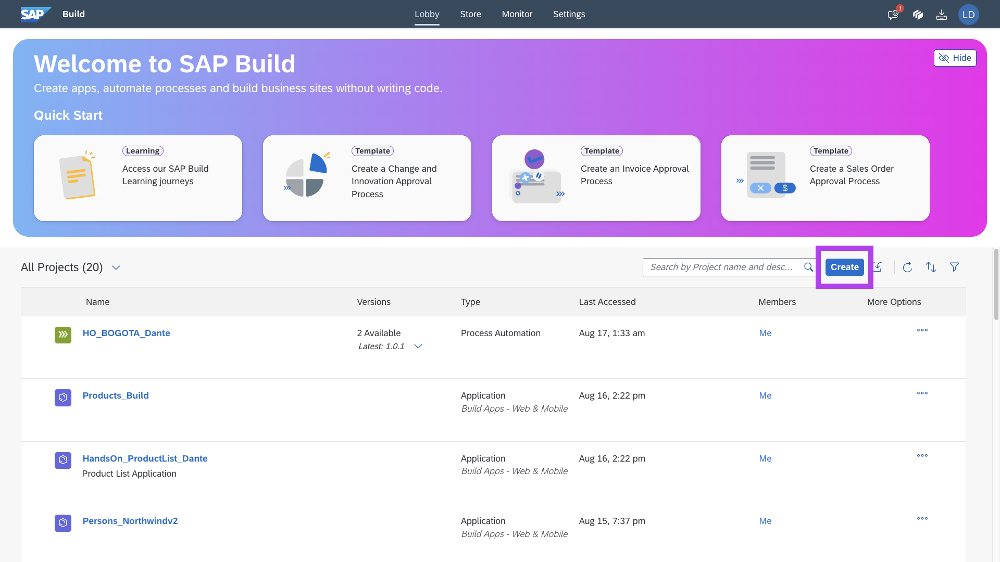
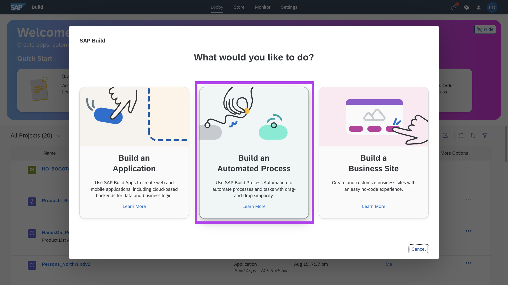
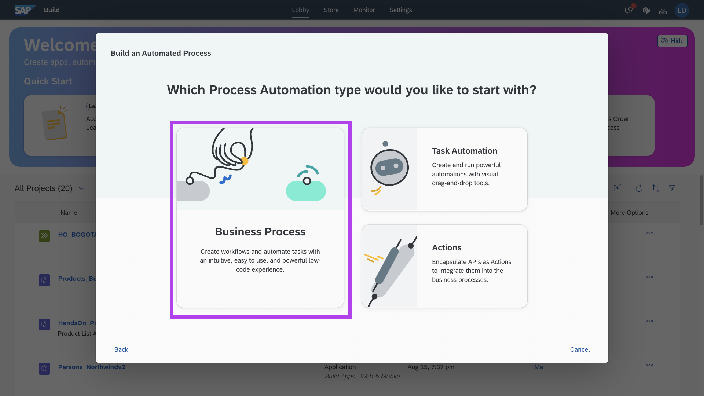
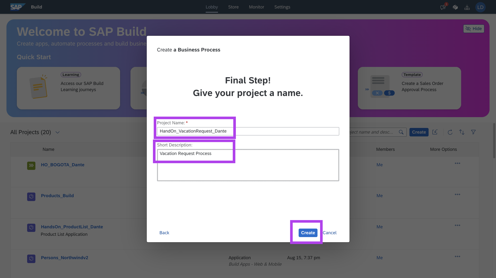
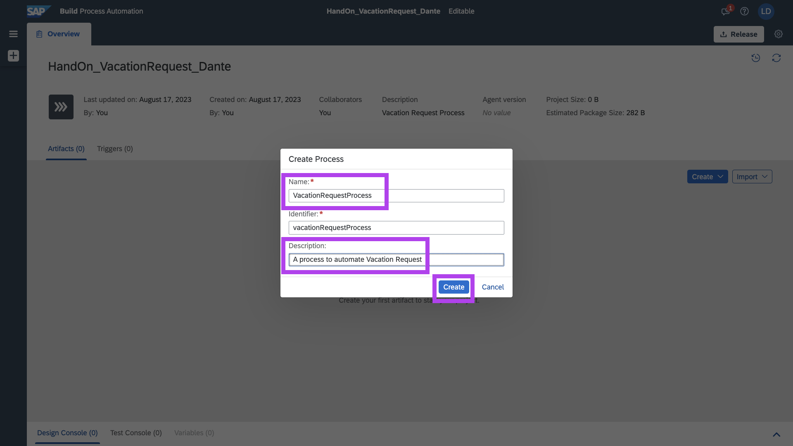
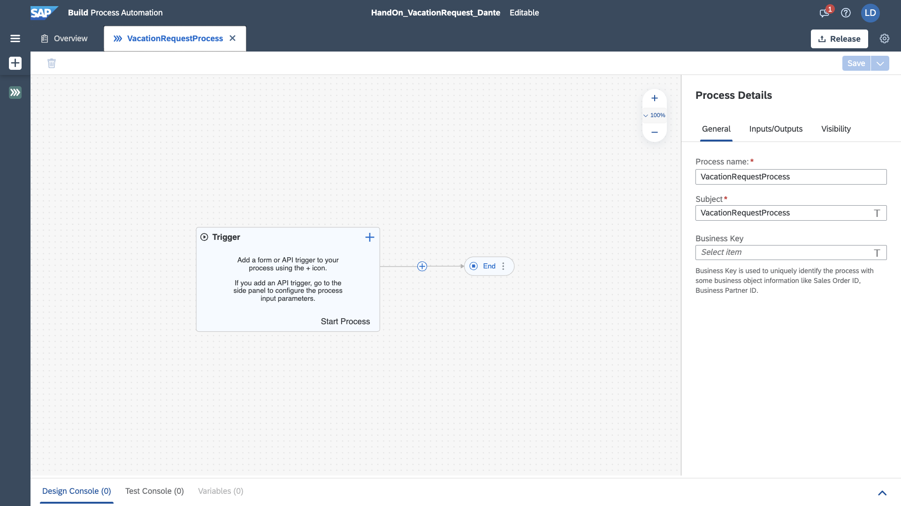

# Exercicio 01 - Criar Novo Process Automation

Bem vindo ao Lobby do SAP Build!

Vamos iniciar nossa jornada com a criação do Process Automation.

Clique no botão azul, **CREATE**



Nessa jornada iremos criar um Automation Process, selecione a opção:  **Build an Automated Process**


Nessa tela temos a opção de Criar um __Automation Process__, __Task Automation__, que contempla as funcionalidades de RPA da SAP, e o __Action__ que torna possivel as integrações com sistemas Legados e S4, através de ODATA.

Selecione __Business Process__, para construirmos nosso fluxo.



Daremos nome e descrição ao nosso fluxo:

```
HandsOn_VacationRequest_[YourName]
```


Com o __Business Process__ criado, vamos realizar a criação do __Process__, entidade de orquestração dentro do BP.

Darei o nome e descrição de:
```
VacationRequestProcess
```


Bom trabalho! Temos agora nosso __Business Process__ e __Process__ criados!



## Próximo Passo:
[Exercício 02 - Trigger Formulario de Solicitação](/exercises/ex2/README.md)