# Exercicio 02 - Trigger Formulario de Solicitação

Neste step iremos criar o formulário onde as solicitações serão geradas.

Clique no botão de mais na caixa de Trigger

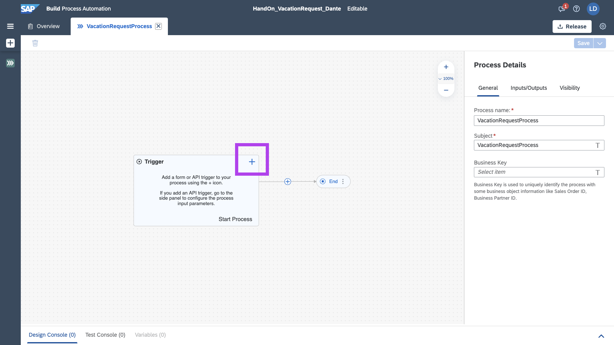

Selecione, __Forms__ e __New Form__

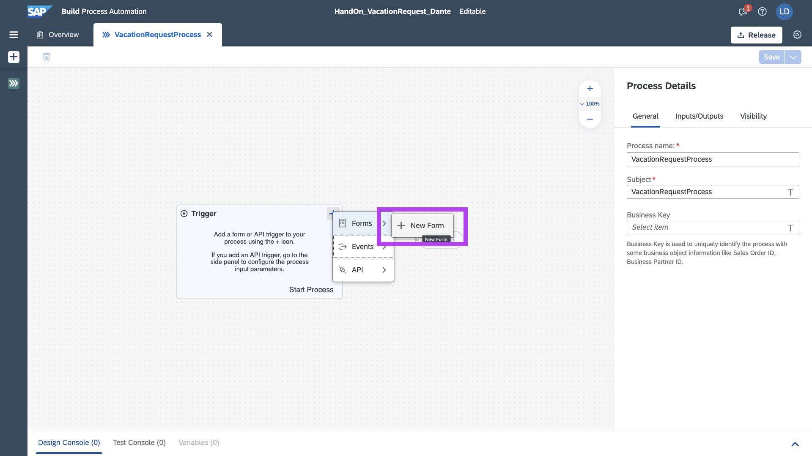

Darei nome e descrição ao Form:

```
frmVacationRequest
```

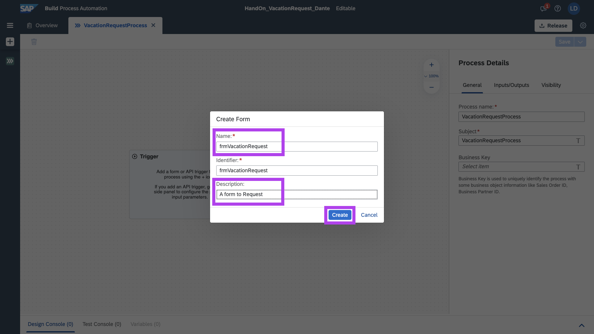

Selecione o Form, dando duplo clique para realizarmos a edição

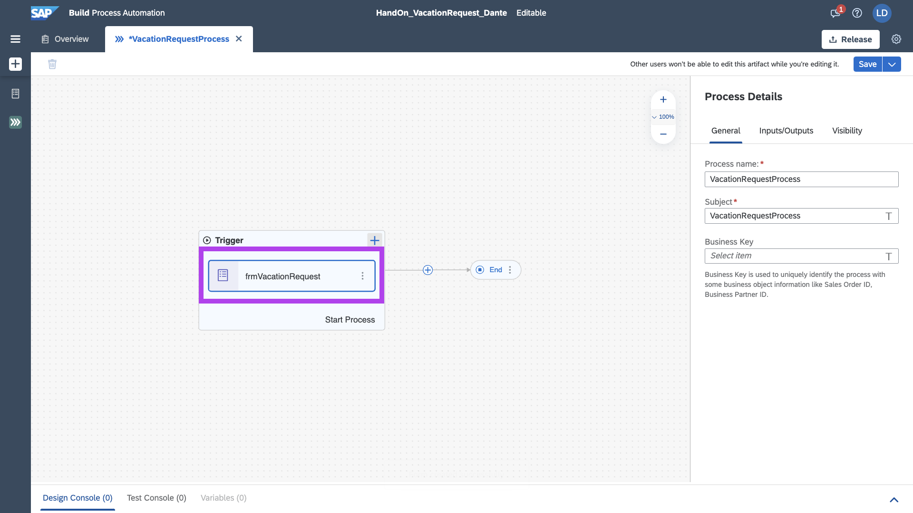

Adicione Titulo H1 e H2, pegando e arrastando
E adicionado seus devidos valores:

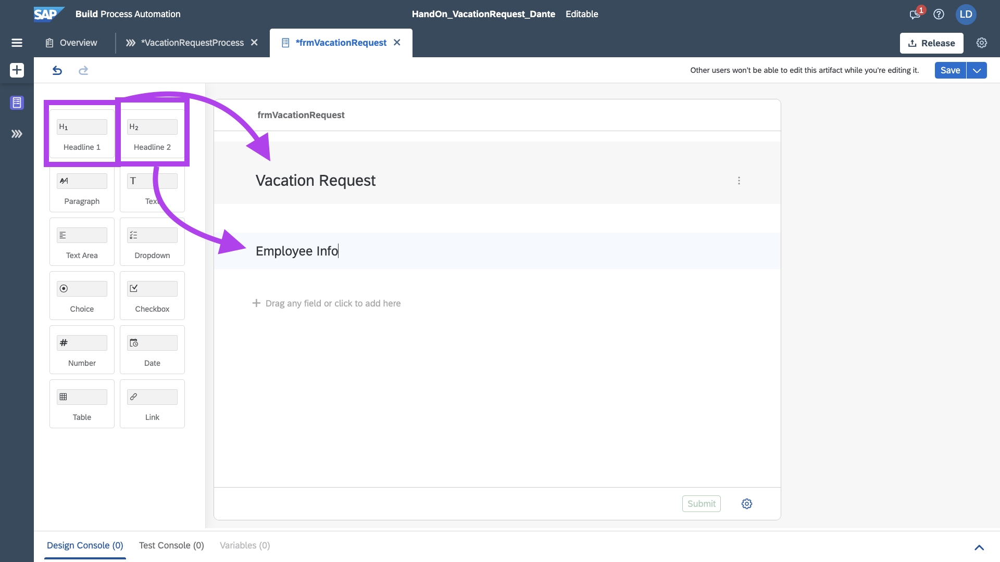

Adicione o Input do tipo Number para o usuário inserir Employee Number.
Selecione também a flag de required, que torna o campo obrigatório.

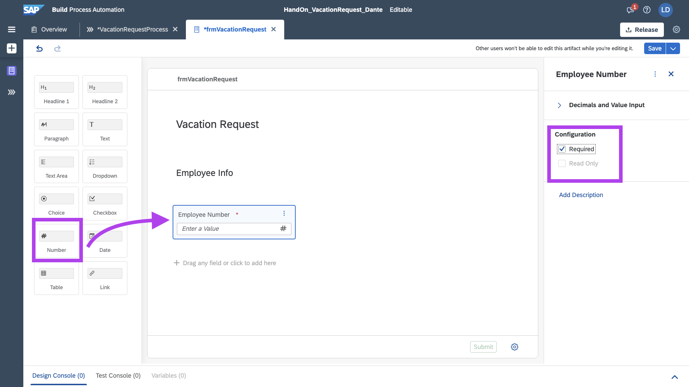

Adicione o Input do tipo Texto para Name, selecione required

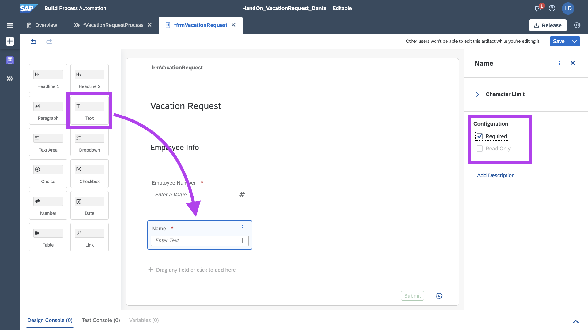

Adicione o Input do Tipo Dropdown e Coloque como padrão dois valores:
```
- TI
- Admin
```

Marque a flag de required.

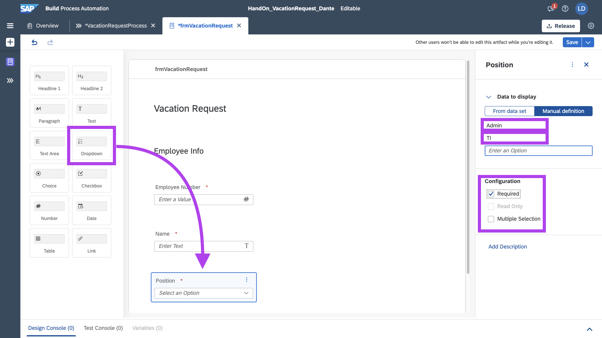

Adicione mais um Titulo H2

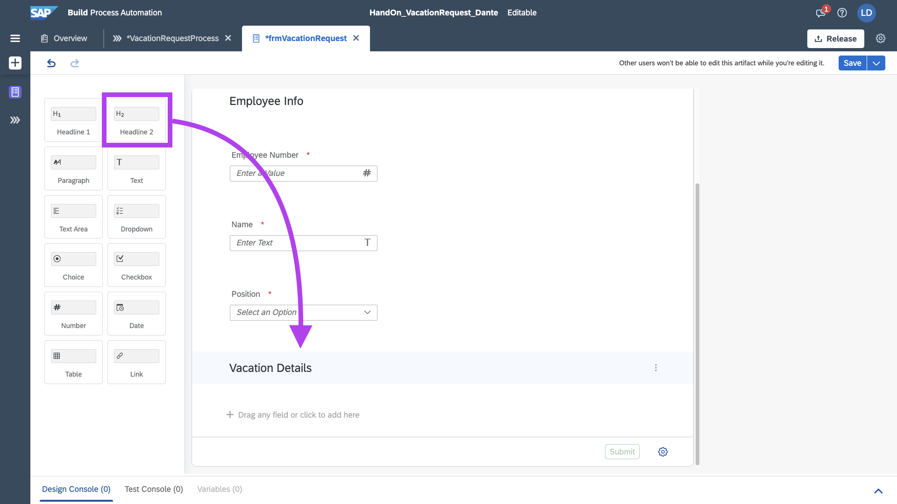

Adicione um Input do tipo Data para StartDate.
Altere o DateOptions, para apenas datas no futuro.
E marque como obrigatório.

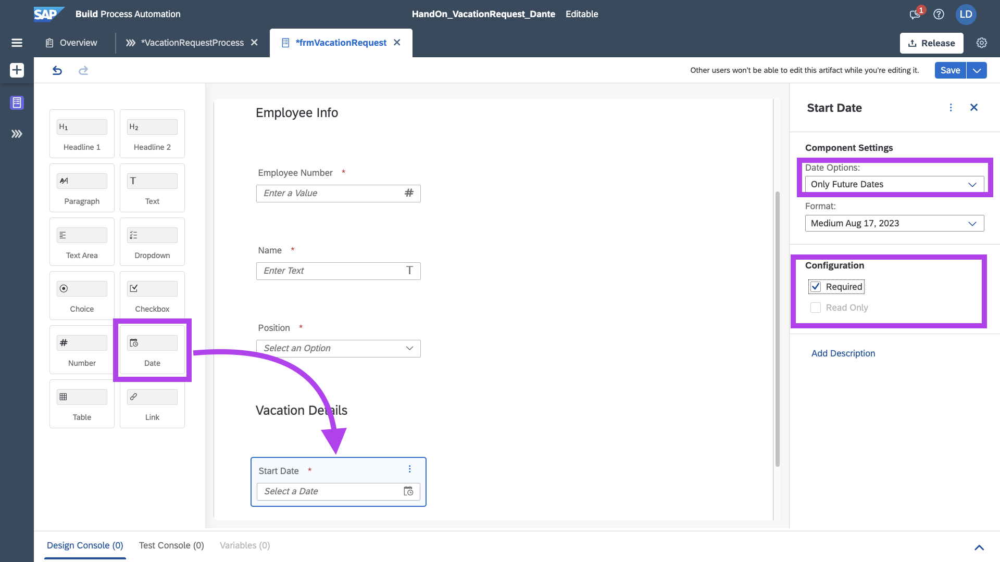

Adicione mais um Input do tipo Data para EndDate, seguindo as mesmas configurações do StartDate.

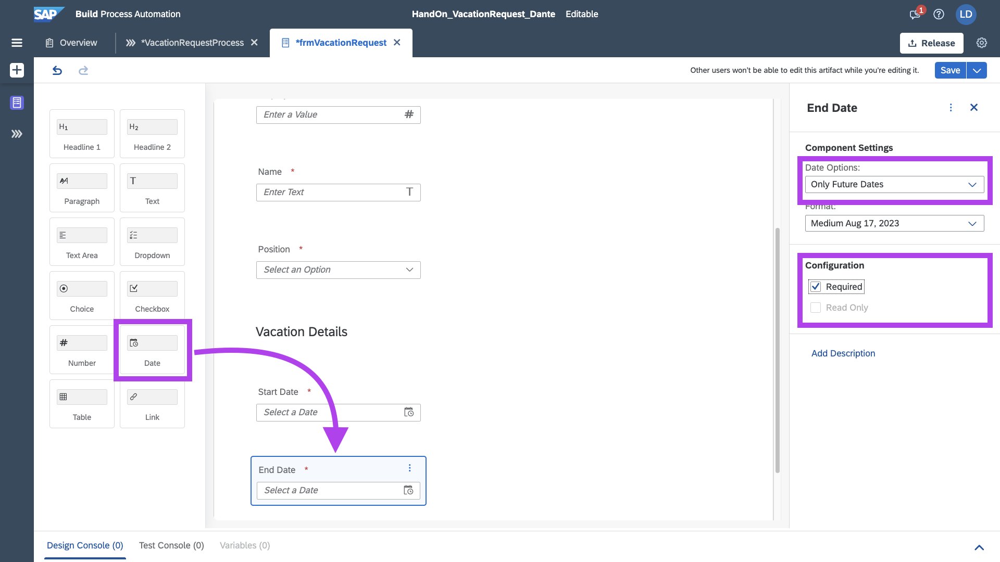

Pronto! Temos nosso formulário de requisição pronto.

Salve o formulário.

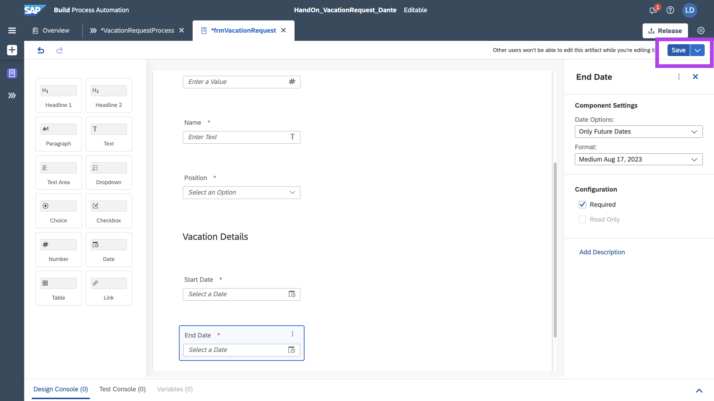

Salve o Process.

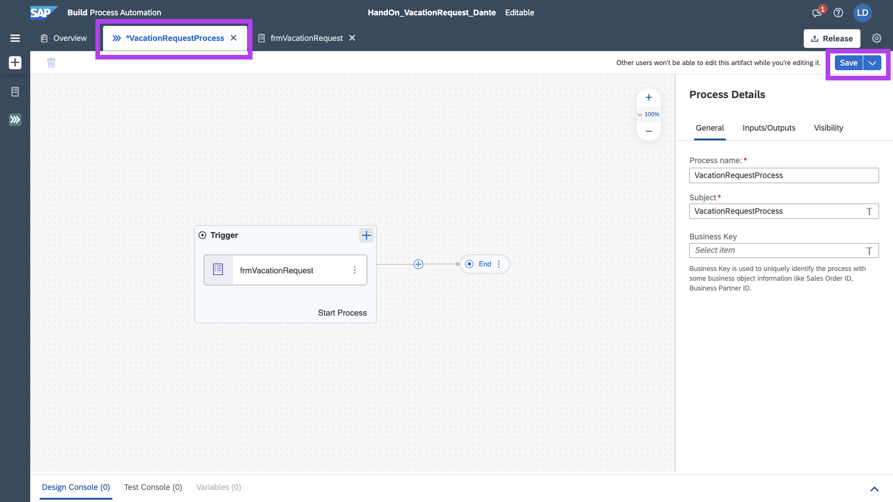

## Próximos Passos:
[Exercício 03 - Tabela de Decisão](exercises/ex3/README.md)