# Exercicio 03 - Tabela de Decisão 

Neste Step criaremos uma tabela de decisão com base nos dados inputados no formulário criado no passo anterior.

A regra será a seguinte:

> Para do solicitações com o Cargo __TI__, serão 10 dias para aprovação.
> Para do solicitações com o Cargo __Admin__, serão 5 dias para aprovação.

Assim balizando a agilidade e urgência para o time de aprovação.

Depois da caixa de Trigger, selecione o botão mais, __Decision__, __New Decision__

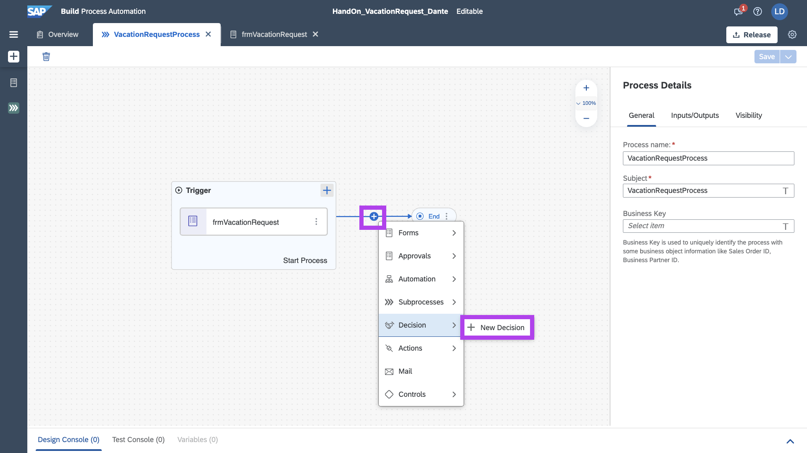

Darei o nome da minha Decision de:

```
dcsPositionVerification
```

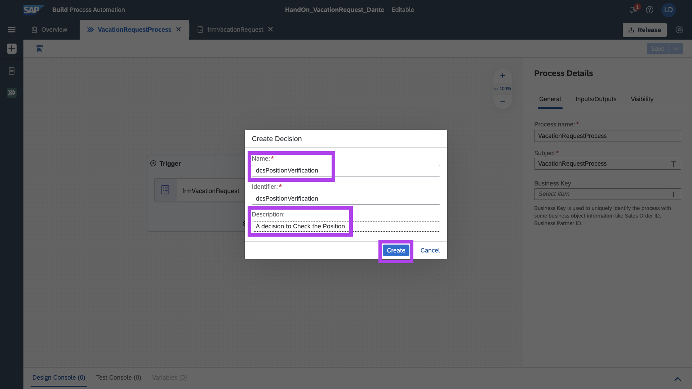

Clique em Edit Decision

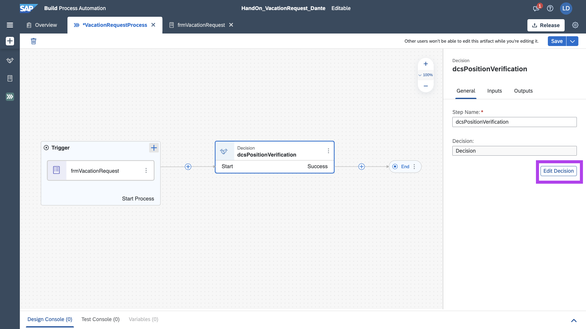

Vamo começar com os Inputs, clique em __Add Input Parameter__

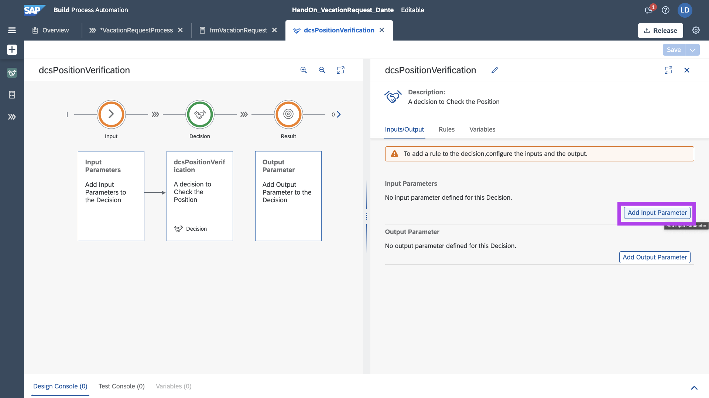

Preencha os parametros de position.

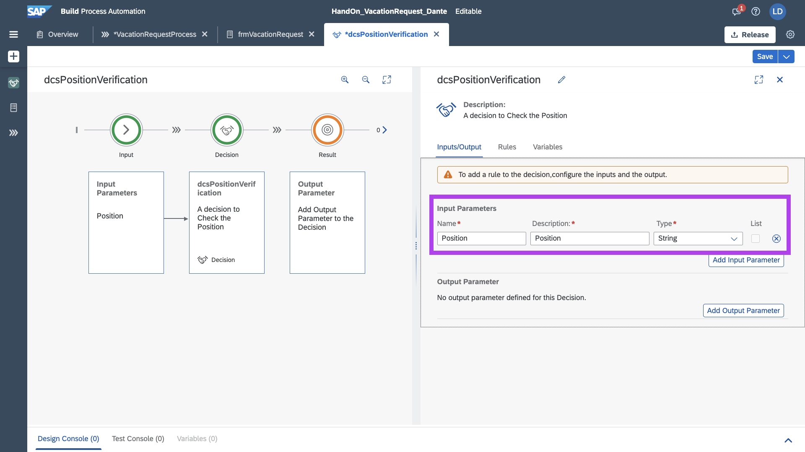

Adicione o Output Parameter, clicando em __Add Output Parameter__

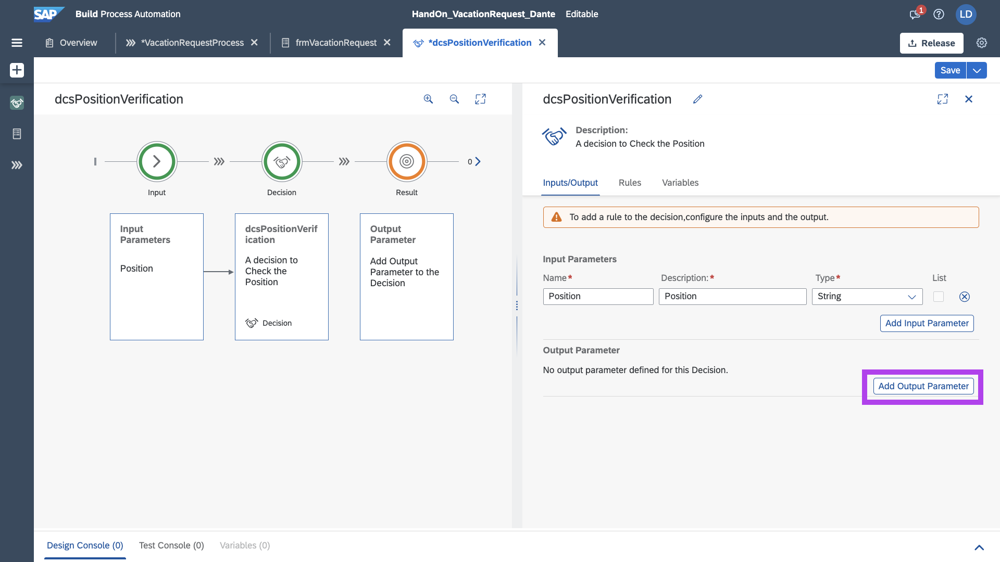

Preencha os parametros conforme à seguir para correto output dos dados de DaysToApprove

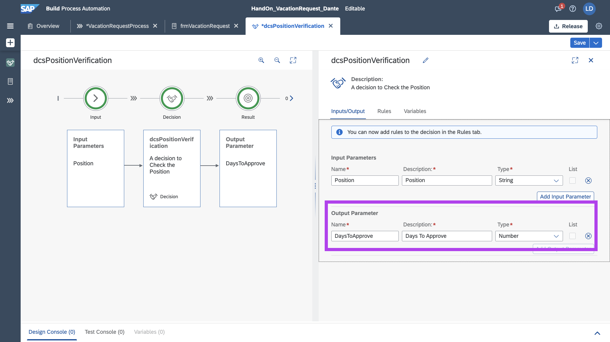

Com os dados de entrada e saida mapeados, podemos criar nossa regra, clique em __Add Rule__

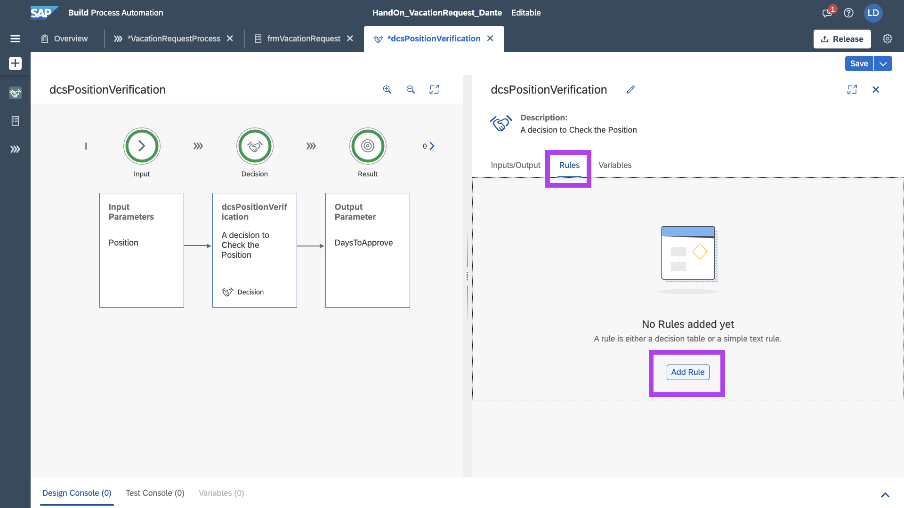

Nesse processo criaremos a tabela de regra, nomeada como:

```
tablePosition
```

Clique em Next Step

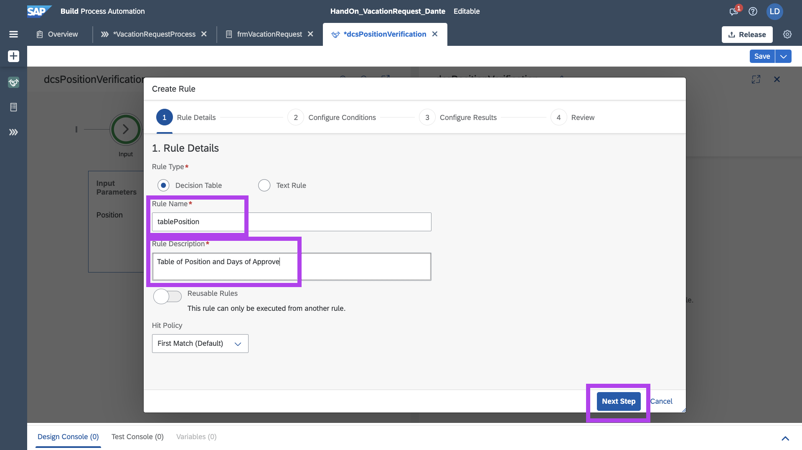

Na condition coloque Position

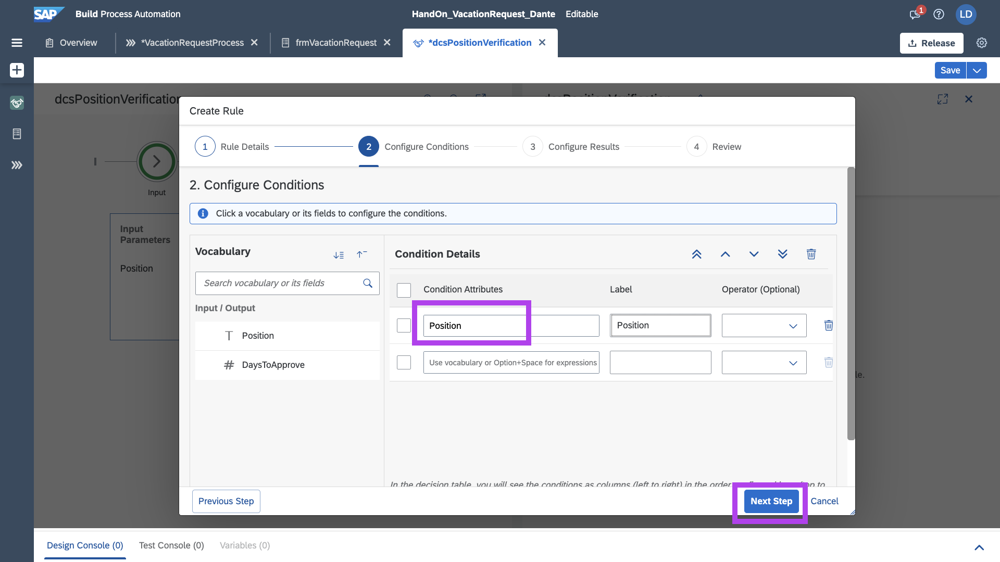

E no results coloque DaysToApprove

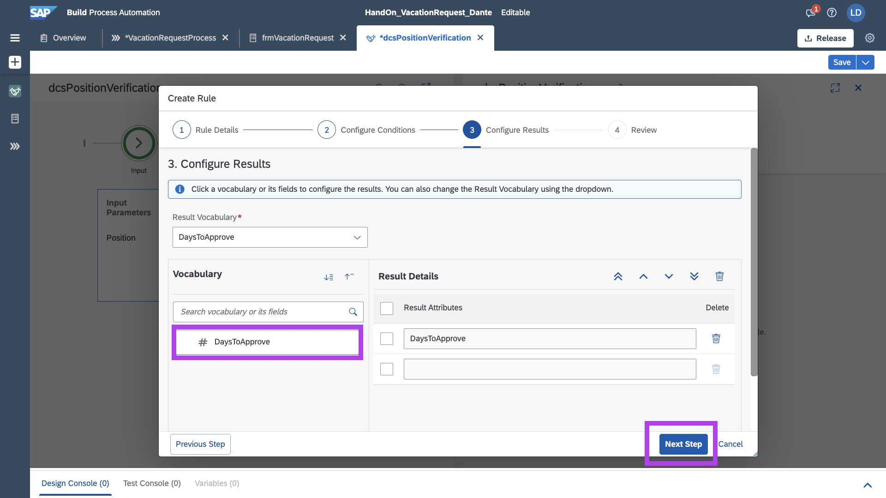

Finalize o processo de parametrização da tabela de regra

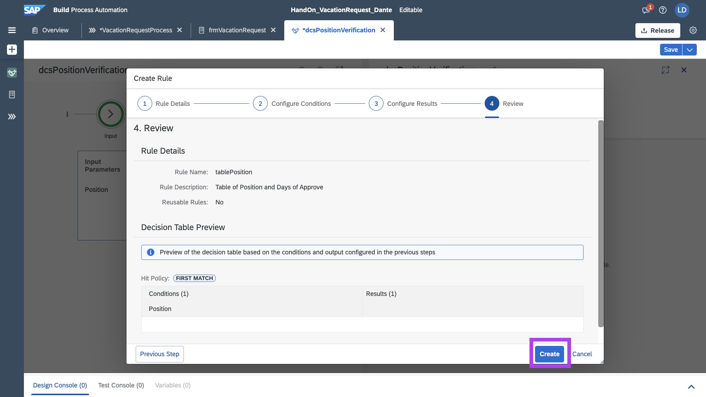

Agora com a tabela criada, podemos criar as regras efetivamente através de algarismos lógicos.

Com base na nossa regra de negócio, foi criada a seguinte tabela:

| Position | DaysToApprove |
|----------|---------------|
| ='TI'    | 10            |
| ='Admin' | 5             |

Salve sua Tabela

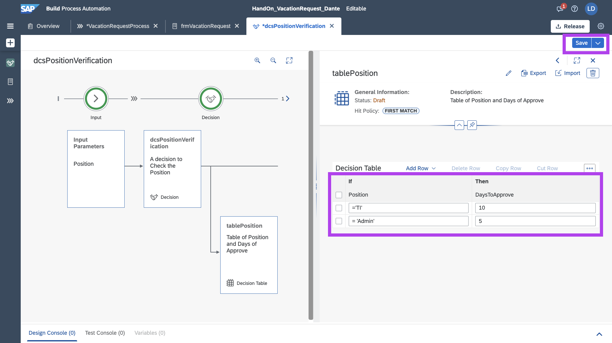

E também Salve o seu Process

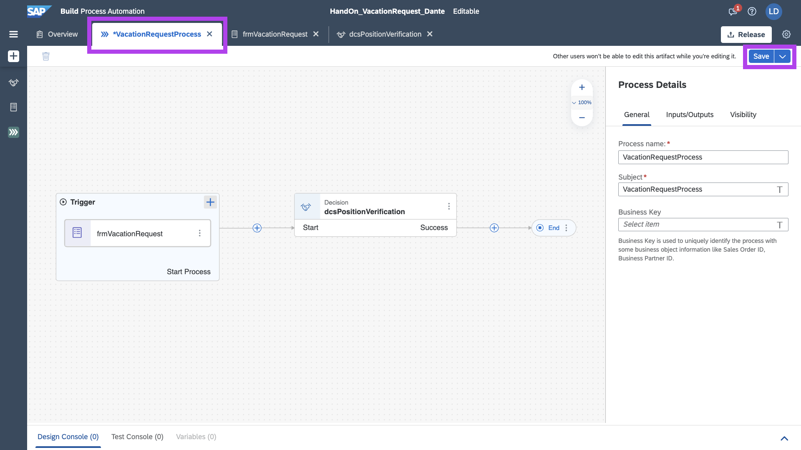

## Próximo Passo:
[Exercício 04 - Formulário de Aprovação](/exercises/ex4/README.md)