# Exercicio 04 - Formulário de Aprovação

Neste Step realizaremos a crição do formulário de aprovação, no qual o gestor terá acesso aos dados da solicitação de forma expandida.

No fluxo do Process, depois do Decision, clique em mais, __Approvals__, __New Approval Form__.

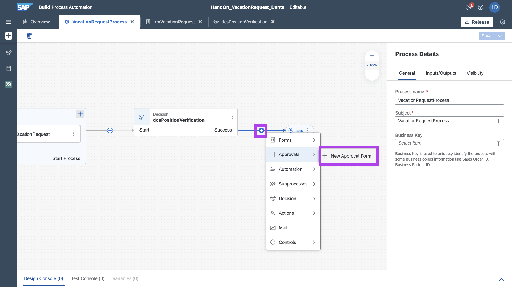

Darei o nome de:

```
frmVacationApproval
```

E clique em Create

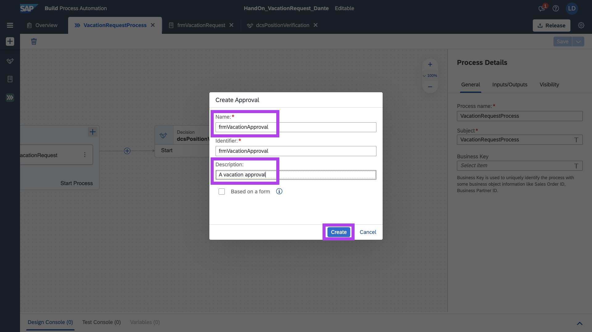

Como subject da solicitação, será feita a concatenação:

```
Vacation Approval - [NAME]
```

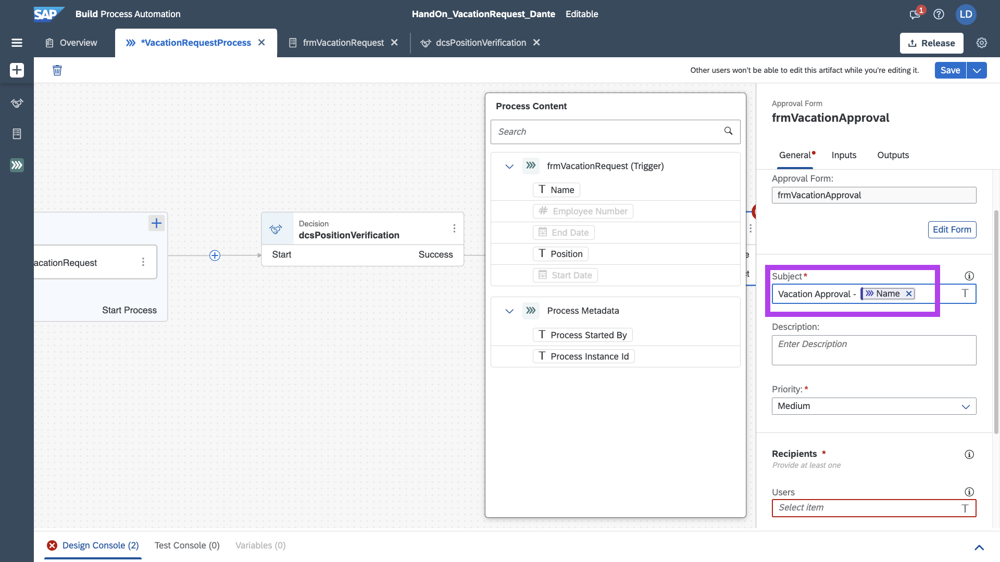

E o usuário que irá receber a solicitação para aprovação, será o proprio requisitante, para podermos testar o end-to-end.

Em cenários de execução real, poderemos utilizar o email corporativo do gestor, para redirecionar a caixa do MyImbox cloud.

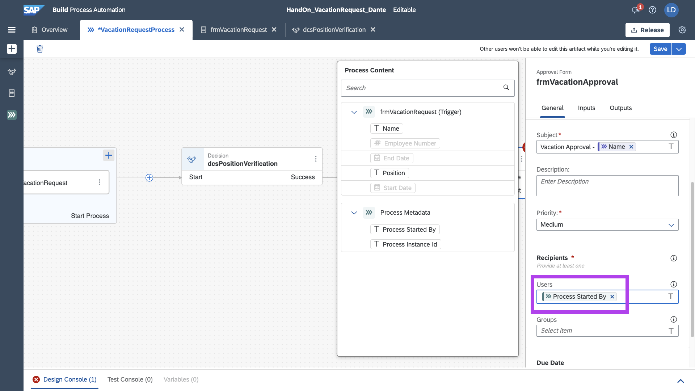

Agora vamos editar visualmente, clique em __Edit Form__

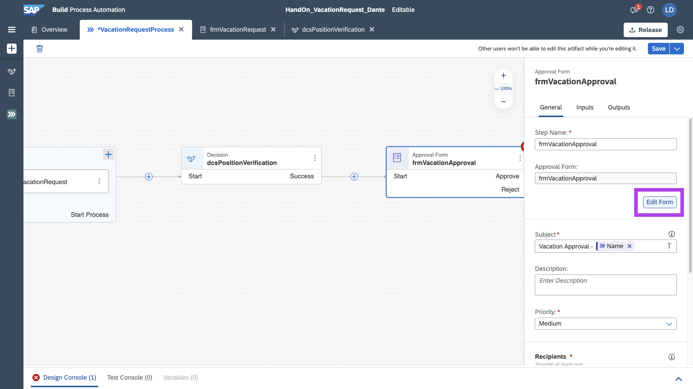

Adicione o Titulo H1

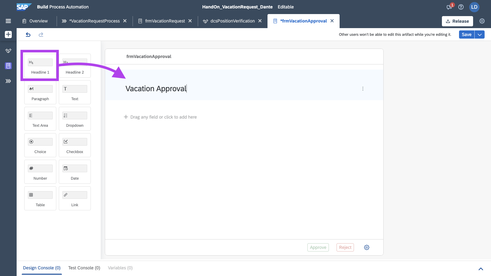

Adicione 3 Inputs de Texto:
```
- Name
- Position
- Email
```

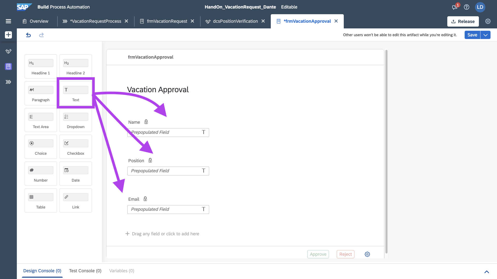

Todos eles deixar com o flag de Read Only selecionado.

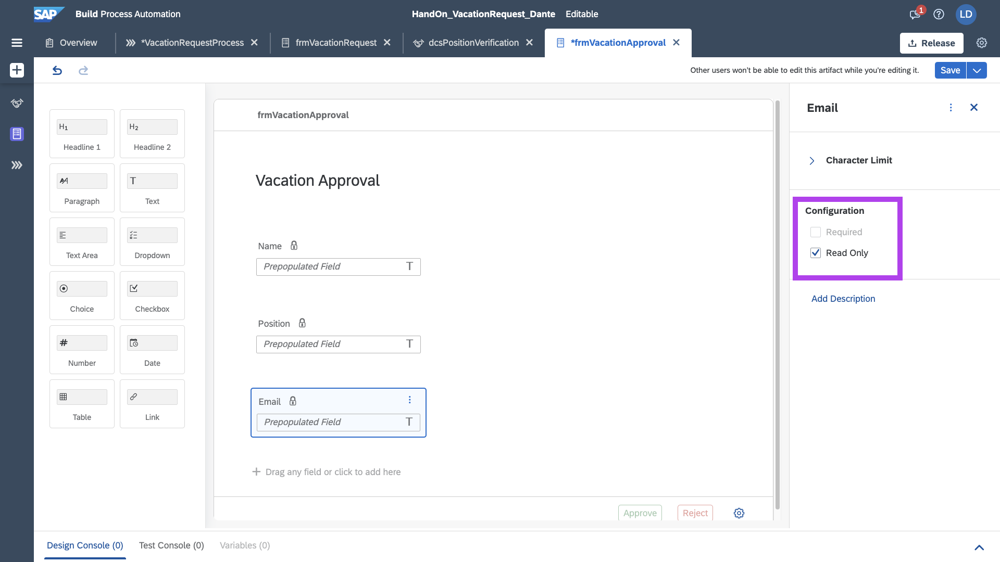

Adicione 2 Inputs de Data para StartDate e EndDate.
E também marcar ReadOnly para ambos.

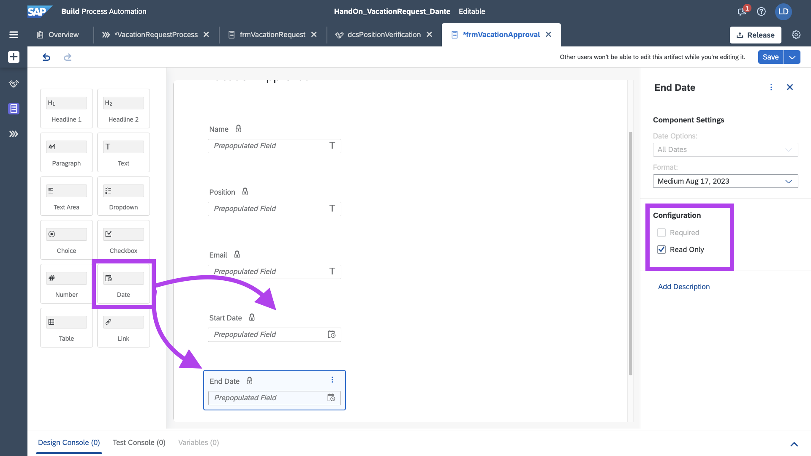

Salve o Formulário.
 
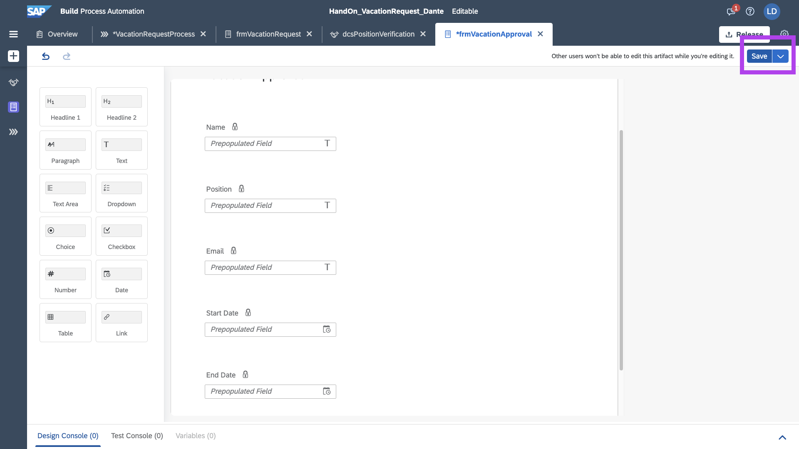

No Card de Approval Form, dentro do Process, Selecione a Tab __Inputs__

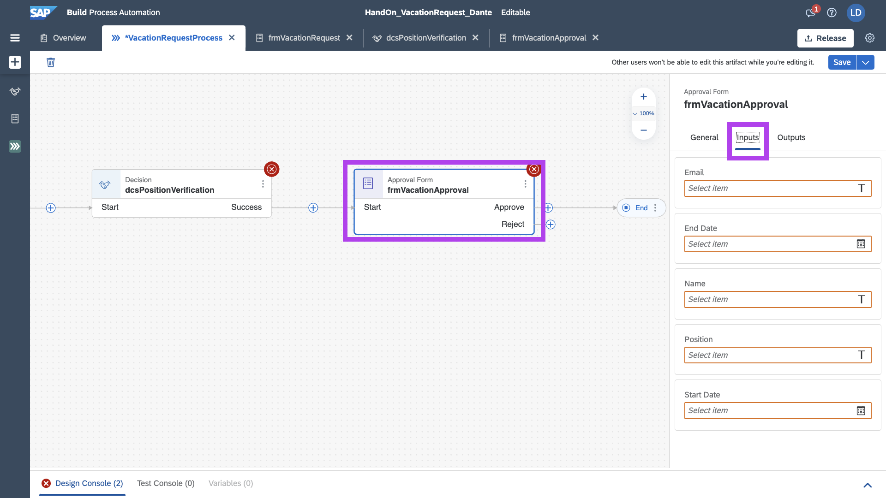

Realize o preenchimento correto com base no Form de solicitação, conforme imagem abaixo.

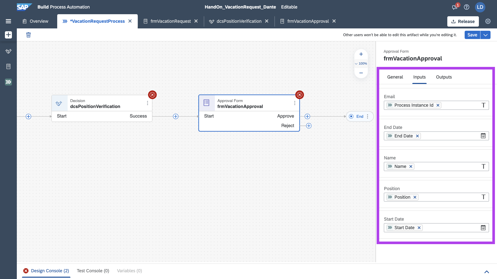

Agora com base na regra criada no Step anterior, configuraremos o tempo de duração daquela requisição.

Na Tab __General__, Altere os parametros de Due Date, com o DaysToApprove do nosso decision.

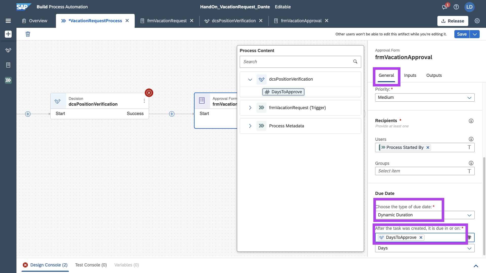

Salve o processo! E formulário de configuração devidamente configurado!

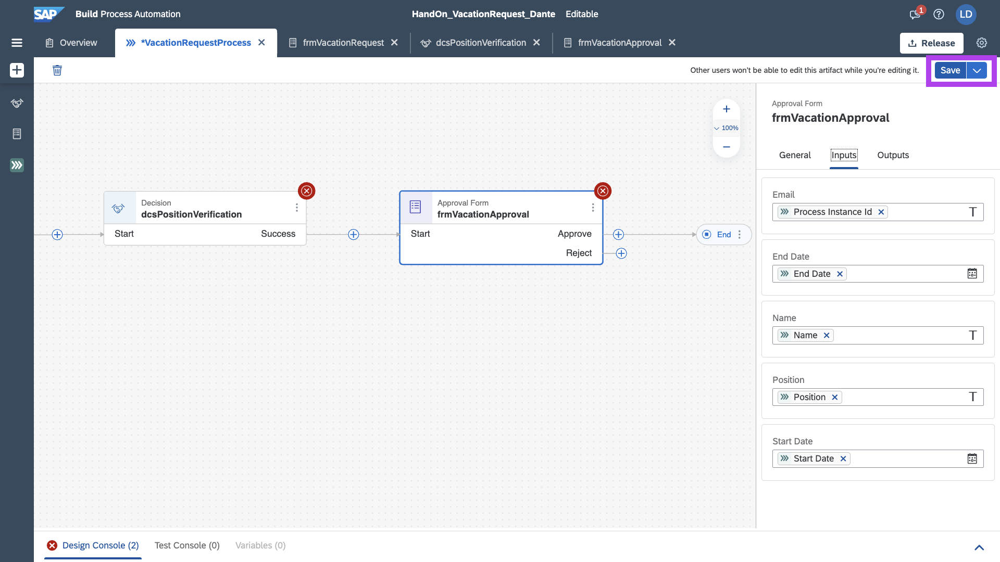

## Próximo Passo:
[Exercício 05 - Atualizar Tabela de Decisão](/exercises/ex5/README.md)