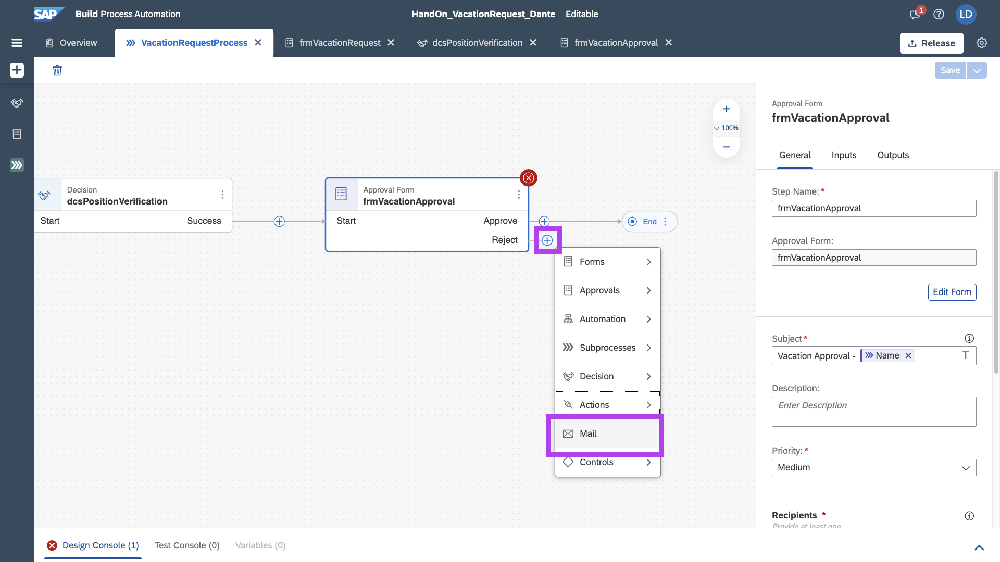
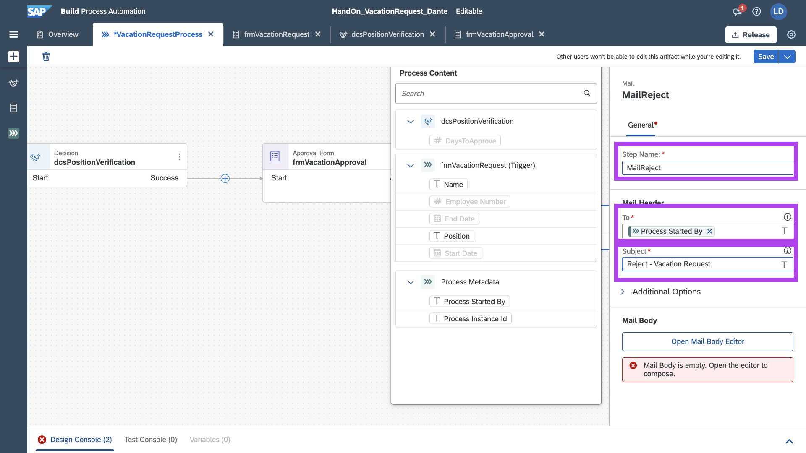
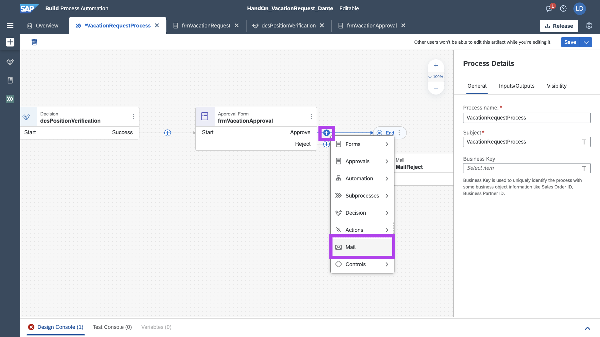
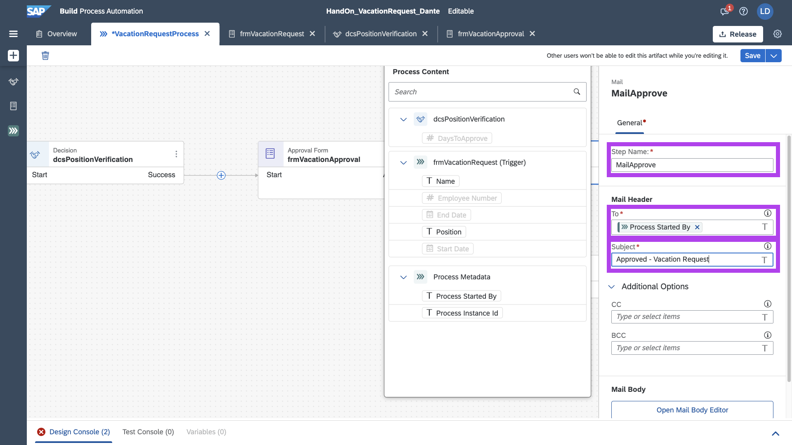
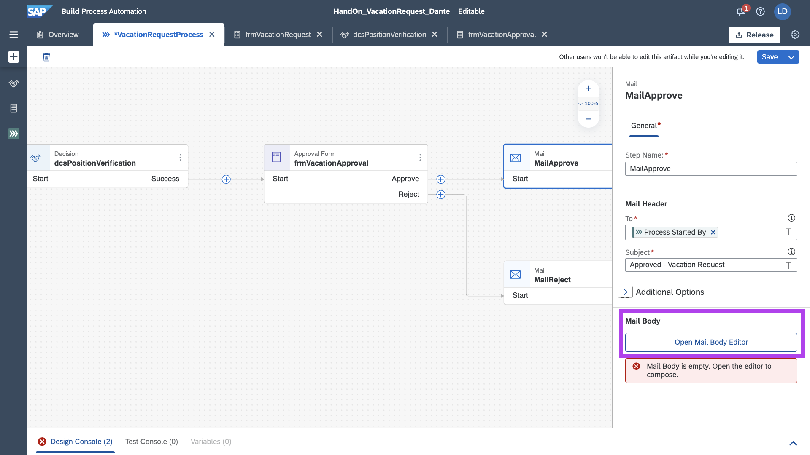
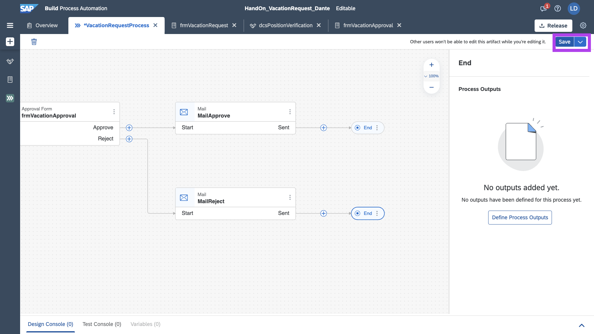

## Exercicio 06 - Enviar email com resposta da Solicitação.

Neste step iremos realizar o Envio de Email, tanto para o cenário de Sucesso, quanto o cenário de Reprovação.

No fluxo, Selecione o Approval Form, e no trigger de __Reject__, adicione um __Mail__.



Para o destinatário, coloque o email do solicitante e como subject:

```
Reject - Vacation Request
```



Clique em __Open Mail Body Editor__, para realizarmos a confecção do email de Reject.


Segue modelo, utilize o bind das variaveis.

```
Hello good afternoon!
Your vacation request
Start Date:
End Date:
Was Rejected.
Tks, Lab2Dev.
```


Agora, vamos implementar a mensageria no cenário de Approved, clicando no mais, no Trigger de Approved, e adicionado __Mail__



Para o destinatário, coloque o email do solicitante e como subject:

```
Approved - Vacation Request
```



Clique em __Open Mail Body Editor__, para realizarmos a confecção do email de Approved.



Segue modelo, utilize o bind das variaveis.

```
Hello good afternoon!
Your vacation request
Start Date:
End Date:
Was Approved.
Tks, Lab2Dev.
```


Com os emails configurados, só é necessário adicionar uma parte que falta no cenário de Reject para finalização do Fluxo.

Adicione Controls, __End__.


Salve o seu Process!



E ele está em perfeito estado e prontissimo para ser executado!

## Próximo Passo

[Exercício 07 - Deploy, Execução e Testes](/exercises/ex7/README.md)


